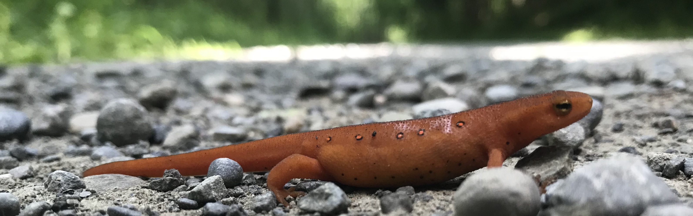

# NeWT: Natural World Tasks

This repository contains resources for working with the NeWT dataset. 

:exclamation: At this time the binary tasks are not publicly available because we are currently organizing a competition that uses NeWT as the evaluation set. Once the competition is finished we will release the dataset and labels (currently planned for Fall 2021).

## Benchmarking Representation Learning for Natural World Image Collections

Source code for reproducing the experiments in the [CVPR 2021 paper](https://arxiv.org/abs/2103.16483) can be found in the [benchmark](benchmark/) directory. 

## iNaturalist 2021 Dataset

The iNat2021 dataset is available [here](https://github.com/visipedia/inat_comp/tree/master/2021).


### Reference  
If you find our work useful in your research please consider citing our paper:  

```latex
@inproceedings{van2021benchmarking,
  title={Benchmarking Representation Learning for Natural World Image Collections},
  author={Van Horn, Grant and Cole, Elijah and Beery, Sara and Wilber, Kimberly and Belongie, Serge and Mac Aodha, Oisin},
  booktitle={Computer Vision and Pattern Recognition},
  year={2021}
}
```
